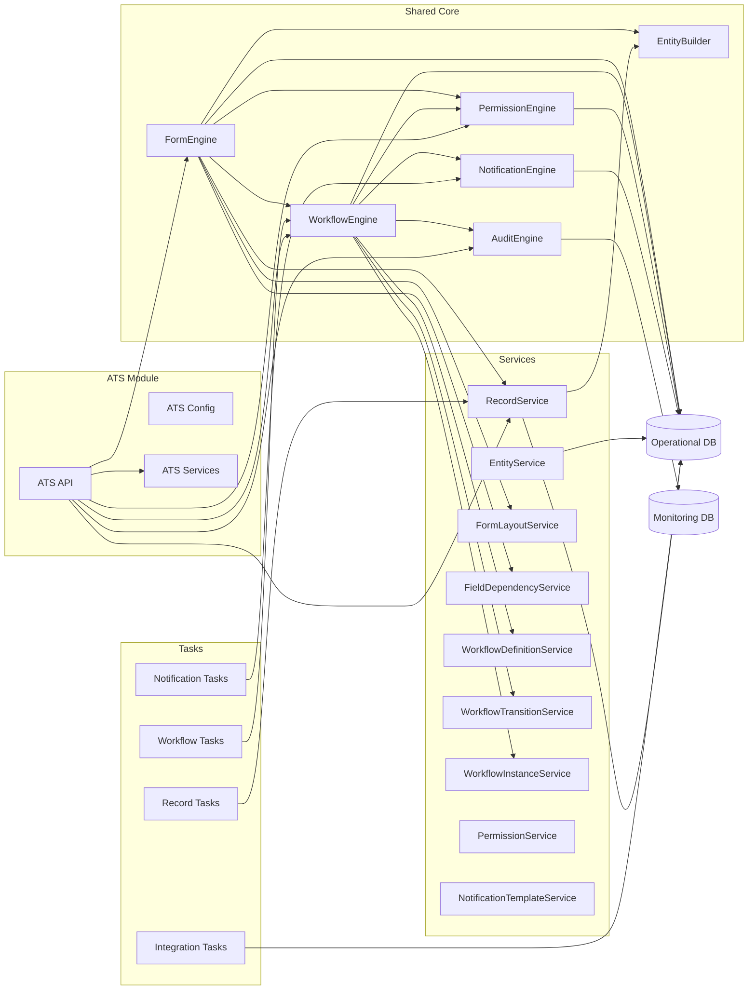
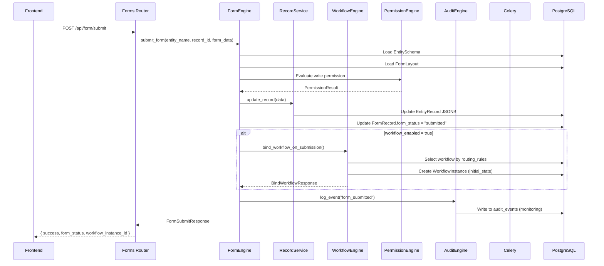
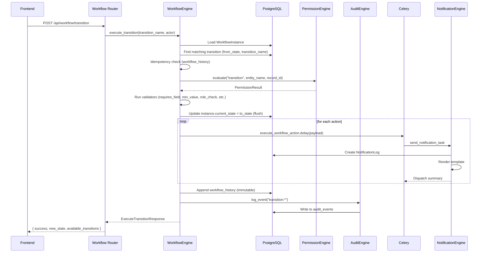
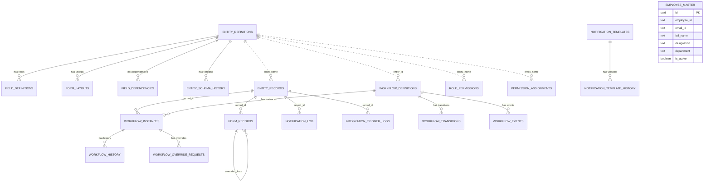

# Overall Architecture — Part 1

## 1. Executive Summary

### Project Overview

The Aerospace ERP backend is a dynamic, configuration-driven enterprise resource planning system built on FastAPI and PostgreSQL. It provides a meta-framework for defining, validating, routing, and approving business records through a fully configurable form and workflow engine.

### Business Purpose

The system exists to eliminate the need for custom code when onboarding new business processes. Rather than writing new endpoints and databases for each approval flow (job requisitions, candidate screening, purchase orders, etc.), administrators define entities, fields, layouts, and approval chains through the API. The backend interprets these definitions at runtime and enforces validations, permissions, state transitions, and notifications automatically.

### Key Objectives

- Enable no-code/low-code business process definition through API-driven configuration.
- Enforce consistent validation, approval chains, and audit trails across all entity types.
- Support multi-tenant-style role-based access with record-level assignments.
- Provide real-time workflow state tracking with immutable history.
- Integrate with external systems (Zoho People, email, object storage) through a pluggable task layer.

---

## 2. System Overview

### High-Level Description

The backend is a stateless FastAPI application that operates against two PostgreSQL databases:

- **Operational database** — stores dynamic entity records, workflow definitions, permission rules, notification templates, employee master data, and all runtime state.
- **Monitoring database** — stores append-only audit events, structured log events, and error events for observability dashboards (Loki, Grafana).

All business behavior is driven by database configuration rather than hardcoded business logic. A module called ATS (Applicant Tracking System) demonstrates the framework's capabilities for candidate and job requisition management.

### Major Capabilities

| Capability | Description |
|---|---|
| Dynamic Entity Management | Define arbitrary business objects (entities) with typed fields, constraints, and versioned schemas. |
| Form Rendering and Lifecycle | Render forms from DB-backed layouts, support drafts, submissions, amendments, and cancellations. |
| Workflow State Machine | Define approval chains as state machines with transitions, validators, and side-effect actions. |
| Permission Engine | Evaluate role-based access control (RBAC) with entity-level rules and record-level role assignments. |
| Notification System | Render and dispatch templated notifications via email with idempotent delivery logging. |
| Audit and Monitoring | Write structured audit events, logs, and error events to a separate monitoring database. |
| File Uploads | Accept file uploads, store in MinIO object storage, and return signed URLs. |
| External Integrations | Sync employee master data from Zoho People; trigger outbound integration events. |
| Async Task Processing | Dispatch workflow side effects through Celery with idempotency guarantees. |

### Core Concepts

| Concept | Definition |
|---|---|
| **Entity** | A named container for a business object type (e.g., `candidates`, `job_requisitions`). All fields, layouts, and workflows attach to an entity. |
| **Field Definition** | A typed attribute of an entity (text, number, enum, date, boolean, file, foreign key). Defines validation constraints and rendering hints. |
| **Form Layout** | A visual arrangement of entity fields into sections with column widths, ordering, and action buttons. |
| **Field Dependency** | A conditional rule that changes a field's visibility, requirement level, or value based on other field values. |
| **Workflow Definition** | A state machine blueprint listing all possible states and routing rules for an entity. |
| **Workflow Transition** | An individual step between states, defining allowed roles, validators, side-effect actions, and UI button configuration. |
| **Workflow Instance** | A runtime copy of a workflow definition tracking the current state of one specific record. |
| **Form Record** | A lifecycle row tracking a record's form status: `draft`, `submitted`, `cancelled`, or `amended`. |
| **Permission Rule** | A DB-backed entry granting a role an action (read, write, transition, etc.) on an entity with a scope (own, all, assigned, team, department, location). |
| **Permission Assignment** | A record-level role grant giving a user an effective role on a specific entity record. |

---

## 3. Architecture Overview

### Architectural Style

The backend follows a **layered, engine-centric architecture** with clear separation of concerns:

- **API Layer** — Thin FastAPI route handlers that validate input, inject dependencies, and return responses.
- **Engine Layer** — Reusable, module-neutral business engines that orchestrate cross-cutting concerns (form rendering, workflow execution, permission evaluation, audit logging, notification dispatch).
- **Service Layer** — Table-level CRUD services that encapsulate persistence logic for individual database tables.
- **Model Layer** — SQLAlchemy ORM models defining the database schema.
- **Task Layer** — Celery asynchronous tasks for side effects that must not block the request/response cycle.
- **Module Layer** — Domain-specific extensions (currently ATS) that add business terminology and workflows without polluting shared engines.

### Layered Structure

```
┌─────────────────────────────────────────────┐
│              API Layer (FastAPI)             │
│  routers: auth, entities, forms, workflow,  │
│          records, permissions, upload, etc. │
├─────────────────────────────────────────────┤
│              Engine Layer                    │
│  FormEngine, WorkflowEngine, PermissionEngine│
│  AuditEngine, NotificationEngine, EntityBuilder│
├─────────────────────────────────────────────┤
│              Service Layer                   │
│  RecordService, EntityService, FormLayoutService│
│  FieldDependencyService, WorkflowDefinitionService│
│  WorkflowTransitionService, WorkflowInstanceService│
│  PermissionService, NotificationTemplateService│
├─────────────────────────────────────────────┤
│              Model Layer (SQLAlchemy)        │
│  entity, record, form, workflow, permission, │
│  notification, employee models               │
├─────────────────────────────────────────────┤
│              Task Layer (Celery)             │
│  workflow_tasks, notification_tasks,         │
│  record_tasks, integration_tasks             │
├─────────────────────────────────────────────┤
│         External Integrations                │
│  PostgreSQL, MinIO, Zoho People, Zoho Mail   │
└─────────────────────────────────────────────┘
```

### Component Relationships

- API routers depend on **Engines** and **Services** via FastAPI `Depends(...)`.
- Engines depend on **Services** for persistence and on other **Engines** for cross-cutting concerns.
- Services depend only on **Models** and the **Database session**.
- Tasks depend on **Engines** and **Services** to perform async side effects independently of the request cycle.
- The ATS module depends on all shared engines and services but owns its own API routes, schemas, and workflow configurations.

---

## 4. Project Structure

### Main Folders

| Path | Responsibility |
|---|---|
| `backend/app/main.py` | FastAPI app assembly. Registers all routers, configures CORS, request context middleware, and verifies monitoring database connectivity on startup. |
| `backend/app/config.py` | Environment-backed settings for operational database, monitoring database, Redis, RabbitMQ, MinIO, authentication (Zoho SSO), and email configuration. |
| `backend/app/database.py` | Async SQLAlchemy engine, session factory, and FastAPI database dependency. |
| `backend/app/api/` | Shared API routers for all major domain areas. Each router is a thin HTTP adapter delegating to engines or services. |
| `backend/app/dependencies/` | FastAPI dependency helpers for auth and engine/service wiring. |
| `backend/app/engines/` | Shared business engines. These are the reusable core and stay module-neutral. |
| `backend/app/models/` | SQLAlchemy ORM models defining the database schema alongside Alembic migrations. |
| `backend/app/modules/` | Domain modules. Module-specific API routes, config, schemas, workflows, and documentation live here. Currently only `ats` is implemented. |
| `backend/app/schemas/` | Pydantic request/response/config schemas shared by APIs and engines. |
| `backend/app/services/` | Shared service layer for table-level CRUD operations. |
| `backend/app/tasks/` | Celery application and asynchronous side-effect tasks. |
| `backend/app/monitoring/` | Structured request context, JSON logging, monitoring DB models/session helpers, and global error handlers. |
| `backend/app/utils/` | Utility helpers including MinIO client, conversion functions, permission constants, and dependency factories. |
| `backend/migrations/` | Alembic migration environments and versioned schema changes. Separate environments for operational and monitoring databases. |
| `backend/seeder/` | Optional dummy data seeder for ATS and shared engine testing. |
| `backend/tests/` | Unit tests and opt-in DB-backed integration tests. |
| `backend/docs/` | Backend-specific documentation including API guides, database schema references, JSON structure contracts, and implementation plans. |

### Key Modules

| Module | Responsibility |
|---|---|
| **Auth** | Zoho SSO OAuth flow, JWT token issuance, current-user lookup. Uses `ZOHO_CLIENT_ID` and `ZOHO_CLIENT_SECRET`. |
| **Entity** | Dynamic entity definition CRUD. Entities are the top-level containers for all configurable business objects. |
| **Field Definition** | Dynamic field CRUD attached to entities. Defines data types, constraints, validation rules, and rendering hints. |
| **Form Layout** | Visual layout CRUD defining sections, field ordering, column widths, and form action buttons. |
| **Field Dependency** | Conditional behavior rules (show, hide, require, set value) based on other field values. |
| **Form Engine** | Renders forms, manages draft/submit/amend/cancel lifecycle, applies field dependencies, assembles workflow context. |
| **Workflow** | Workflow definition and transition CRUD (setup), plus runtime endpoints for binding, context, transition execution, and history. |
| **Record** | Generic entity record CRUD through `RecordService`. Persists JSONB business data for any dynamic entity. |
| **Permission** | Role permission and permission assignment CRUD. Enforced by `PermissionEngine`. |
| **Notification Template** | Versioned notification template CRUD with immutable history snapshots. |
| **Upload** | File upload endpoint storing files in MinIO and returning object keys and temporary URLs. |
| **Email** | Direct email API sending through Zoho Mail, queued via Celery, with notification log persistence. |
| **Zoho People** | Employee master sync from Zoho People API and active employee dropdown endpoints. |
| **Health** | Lightweight health check and root endpoint. |
| **ATS Module** | Domain-specific candidate and job requisition endpoints with legacy transition mapping, built on top of the shared engine layer. |

---

## 5. Core Modules

### 5.1 Form Engine Module

**Purpose:** The Form Engine is the central orchestrator for a record's visual and transactional state. It assembles a fully resolved form schema from entity definitions, form layouts, field dependencies, permission masks, and workflow context.

**Responsibilities:**
- Render forms for create, edit, and view modes.
- Manage `form_status` lifecycle: `draft → submitted → amended` or `draft → cancelled`.
- Evaluate field dependencies to dynamically show, hide, require, or set field values.
- Apply permission masks to determine field visibility and editability.
- Create and manage `FormRecord` lifecycle rows.
- Support amend operations that create new draft versions of submitted records.
- Assemble workflow context (current state, available transitions, locked fields) on form load.

**Dependencies:**
- `EntityBuilder` — resolves entity schema from the database.
- `PermissionEngine` — evaluates field-level access masks.
- `WorkflowEngine` — provides current state and available transitions.
- `RecordService` — persists entity record data.
- `FormLayoutService` — retrieves active form layouts.
- `FieldDependencyService` — retrieves conditional rules.

**Interactions:**
- Called by `app/api/forms.py` route handlers on every form render, draft save, submit, amend, and cancel.
- On submit, delegates to `WorkflowEngine.bind_workflow_on_submission()` if the layout has `workflow_enabled = true`.

### 5.2 Workflow Engine Module

**Purpose:** The Workflow Engine is a stateless execution engine for state machine operations. It validates transitions, enforces role and record permissions, evaluates conditions, logs immutable history, and dispatches async side-effect actions.

**Responsibilities:**
- Bind workflow instances to submitted records based on routing rules.
- Execute state transitions with full TCA (Trigger-Conditions-Actions) pipeline.
- Validate transition reachability, allowed roles, and custom validators (required fields, min/max, regex, expiry, role check).
- Enforce `from_state` checks to prevent out-of-sequence moves.
- Handle override requests for admin force-approval paths.
- Log every transition to immutable `workflow_history` with idempotency keys.
- Dispatch async actions (notify, assign_to, update_field, integration_trigger) to Celery.
- Provide workflow context (current state, available transitions, locked fields) for form rendering.

**Dependencies:**
- `PermissionEngine` — checks record write access for transition execution.
- `NotificationEngine` — renders and dispatches notification templates.
- `AuditEngine` — writes audit events for workflow transitions.
- `WorkflowDefinitionService` — retrieves active workflow definitions.
- `WorkflowTransitionService` — retrieves transition definitions.
- `WorkflowInstanceService` — manages workflow instance lifecycle and history.

**Interactions:**
- Called by `app/api/workflow.py` on bind, context, transition, instance, and history requests.
- Called by `FormEngine` during form submit when workflow is enabled.
- Dispatches actions to `app/tasks/workflow_tasks.py` for async execution.

### 5.3 Permission Engine Module

**Purpose:** The Permission Engine is the application-layer RBAC enforcement system. It evaluates database-backed role-permission rules combined with record-level role assignments to answer entity and record access checks.

**Responsibilities:**
- Evaluate role-permission rules from `role_permissions` table.
- Merge actor's canonical roles with record-level `permission_assignments`.
- Enforce scope priority: `all > own > assigned > team > department > location`.
- Return field-level access masks (read/write) for form rendering.
- Support actions: `read`, `create`, `write`, `delete`, `submit`, `transition`, `assign`, `comment`, `upload`, `export`.
- Validate that requested actions are in the supported set.

**Dependencies:**
- `RolePermission` model — entity-level action/scope rules per role.
- `PermissionAssignment` model — record-level role grants.

**Interactions:**
- Called by `FormEngine` on every render to determine field visibility and editability.
- Called by `WorkflowEngine` indirectly through `allowed_roles` in transition definitions.
- Called by ATS module endpoints for entity-level read/write checks.
- Managed through `app/api/permissions.py` CRUD endpoints.

### 5.4 Audit Engine Module

**Purpose:** The Audit Engine writes append-only audit events to the separate monitoring database for traceability and compliance.

**Responsibilities:**
- Persist audit events with actor, entity, record, workflow, source, and metadata context.
- Support before/after value change tracking (`old_value`, `new_value`).
- Best-effort write pattern — monitoring database failures do not block business operations.
- Use structured JSON metadata aligned with `backend/docs/JSON_STRUCTURES.md`.

**Interactions:**
- Called by `FormEngine` on record creation and status changes.
- Called by `WorkflowEngine` on every transition execution.
- Called by ATS module on record operations.
- Persists to `MONITORING_DATABASE_URL.audit_events` via `app/monitoring/service.py`.

### 5.5 Notification Engine Module

**Purpose:** The Notification Engine resolves notification templates, renders message content from context, and persists per-recipient delivery logs.

**Responsibilities:**
- Look up active `NotificationTemplate` by name.
- Render subject and body using `format_map` with flat context keys.
- Classify recipients as user UUIDs, email addresses, or role names.
- Create `NotificationLog` rows with idempotency keys to prevent duplicate sends.
- Dispatch actual email delivery through `EmailService` for direct email recipients.
- Return dispatch summaries with created, cached, and failed counts.

**Interactions:**
- Called by `WorkflowEngine` actions and Celery `notification_tasks.py`.
- Uses `EmailService` for Zoho Mail delivery.
- Persists delivery status (`queued`, `sent`, `delivered`, `failed`, `bounced`) to `NotificationLog`.

### 5.6 Entity Builder Module

**Purpose:** The Entity Builder is the read-side adapter between the dynamic entity catalog in the database and the shared `EntitySchema` Pydantic model used by higher-level engines.

**Responsibilities:**
- Resolve active entity schemas from `entity_definitions` and `field_definitions`.
- Resolve historical schemas from `entity_schema_history` for older record versions.
- Normalize ORM rows or JSON snapshots into a consistent `EntitySchema` shape.
- Order fields by creation time and name for deterministic rendering.

**Interactions:**
- Called by `FormEngine` to load entity structure for rendering and validation.
- Called by `RecordService` to validate required fields on record creation.
- Does not mutate entity definitions — read-only factory.

### 5.7 ATS Module

**Purpose:** The ATS (Applicant Tracking System) module demonstrates the framework's capabilities for hiring workflows. It keeps applicant-tracking terminology and setup out of the shared engines.

**Responsibilities:**
- Expose candidate and job requisition endpoints.
- Manage ATS-specific entity creation and field definitions.
- Provide legacy transition mapping for ATS-specific workflow transitions.
- Shape ATS-specific response payloads.
- Manage ATS workflow configuration persistence.

**Dependencies:**
- All shared engines: `FormEngine`, `WorkflowEngine`, `PermissionEngine`, `AuditEngine`.
- All shared services: `RecordService`, `EntityService`.
- Shared models and schemas.

**Interactions:**
- Registered as `ats_router` in `app/main.py` under `/api` prefix.
- Uses dependency injection pattern matching the shared engine layer.
- Owns ATS-specific workflow definitions in `app/modules/ats/workflows/`.

---

## 6. Database Architecture

### Major Entities

The operational database contains 21 application tables organized into functional groups:

| Group | Tables | Purpose |
|---|---|---|
| **Entity Catalog** | `entity_definitions`, `field_definitions`, `entity_schema_history` | Dynamic entity and field definitions with versioned schema snapshots. |
| **Form Management** | `form_layouts`, `field_dependencies`, `form_records` | Form visual layout, conditional rules, and lifecycle state tracking. |
| **Workflow Engine** | `workflow_definitions`, `workflow_transitions`, `workflow_instances`, `workflow_events`, `workflow_history`, `workflow_override_requests`, `workflow_task_executions`, `integration_trigger_logs` | State machine definitions, runtime instances, immutable history, override handling, and async task idempotency. |
| **Permission** | `role_permissions`, `permission_assignments` | RBAC rules and record-level role grants. |
| **Notification** | `notification_templates`, `notification_template_history`, `notification_log` | Versioned email templates and delivery audit logs. |
| **Employee Master** | `employee_master` | Zoho People-synced employee data for dropdowns and role directory. |
| **Generic Records** | `entity_records` | JSONB business data for all dynamic entity types. |

The monitoring database contains 3 tables for observability:

| Table | Purpose |
|---|---|
| `audit_events` | Append-only audit stream for record, form, workflow, and ATS events. |
| `error_events` | Normalized application errors and unhandled exceptions for dashboards. |
| `log_events` | Structured logger records for warning, error, and critical logs. |

### Relationships

| Relationship | Type | Meaning |
|---|---|---|
| `field_definitions.entity_id → entity_definitions.id` | FK | Fields belong to an entity definition. |
| `form_layouts.entity_id → entity_definitions.id` | FK | Form layouts belong to an entity definition; cascades on delete. |
| `field_dependencies.entity_id → entity_definitions.id` | FK | Conditional rules belong to an entity definition; cascades on delete. |
| `entity_schema_history.entity_id → entity_definitions.id` | FK | Historical snapshots belong to an entity definition. |
| `workflow_definitions.entity_id → entity_definitions.id` | Logical | Workflow definitions are created for an entity definition. |
| `workflow_transitions.workflow_id → workflow_definitions.id` | FK | Transitions belong to a workflow. |
| `workflow_instances.workflow_id → workflow_definitions.id` | FK | Instances run a workflow definition. |
| `workflow_instances.record_id → entity_records.id` | Logical | Instances run against entity records. |
| `workflow_history.instance_id → workflow_instances.id` | FK | History rows belong to a workflow instance. |
| `workflow_override_requests.instance_id → workflow_instances.id` | FK | Override requests belong to a workflow instance. |
| `notification_template_history.template_id → notification_templates.id` | FK | Template history belongs to a template. |
| `permission_assignments.record_id → entity_records.id` | Logical | Assignments grant roles on an entity record. |
| `role_permissions.entity_name → entity_definitions.name` | Logical | Permission rules are scoped by entity name. |
| `form_records.record_id → entity_records.id` | Logical | Form lifecycle rows point to the current entity record. |
| `form_records.amended_from_id → form_records.id` | FK | Amendment lineage between form records. |

### Important Constraints

- `entity_definitions.name` is unique and serves as the stable identity key used throughout APIs and records.
- `field_definitions` has a unique constraint on `(entity_id, name)`.
- `role_permissions` has a unique constraint on `(role, entity_name, action)` and check constraints for valid action and scope values.
- `permission_assignments` has a unique constraint on `(entity_name, record_id, user_id, role)`.
- Reserved keys inside `entity_records.data`: `id`, `uuid`, `record_id` — these are rejected on create and update to prevent identity conflicts.
- Email linkage: when `entity_records.data` contains `email`, it is treated as a unique logical identifier — cannot be changed after creation, must be unique within an entity.
- `workflow_instances.current_state` is persisted via `db.flush()` before any Celery tasks are dispatched, ensuring state consistency.

---

## 7. Authentication and Authorization

### Authentication Flow

The system uses **Zoho SSO OAuth 2.0** for authentication:

1. User clicks login → redirected to `GET /api/auth/login`.
2. Backend builds Zoho authorization URL with `client_id`, `scope=openid+email+profile`, and `redirect_uri`.
3. Zoho authenticates the user and redirects back to `GET /api/auth/callback` with an authorization code.
4. Backend exchanges the code for an access token at Zoho's token endpoint.
5. Backend fetches user info from Zoho's `/oauth/v2/userinfo` endpoint.
6. Email domain is validated against `ZOHO_ORG_DOMAIN` (defaults to `erp.local`).
7. Roles are assigned: `admin` for org domain users, `candidate` for external users.
8. A JWT is issued with claims: `sub`, `email`, `roles`, `name`, `exp` (1 hour TTL).
9. Frontend receives the token via redirect and includes it as `Bearer <token>` in subsequent requests.

### Permission Model

The permission system is **database-backed RBAC** with the following components:

| Component | Description |
|---|---|
| **Role** | A canonical role string from the set: `admin`, `super_admin`, `ptc`, `hm`, `director`, `founder`, `candidate`, `screening_team`, `system`, `ats_admin`. |
| **Action** | An operation: `read`, `create`, `write`, `delete`, `submit`, `transition`, `assign`, `comment`, `upload`, `export`. |
| **Scope** | The breadth of access: `all` (everything), `own` (own records), `assigned` (assigned records), `team`, `department`, `location`. |
| **Rule** | A `role_permissions` row binding role + entity + action + scope. |
| **Assignment** | A `permission_assignments` row granting a user a role on a specific record. |

### Role Model

- **Actor** — the authenticated user context passed through the system. Contains `id`, `email`, `roles`, `name`.
- **Canonical roles** — a fixed set of recognized roles. Actor roles are filtered to this set during evaluation.
- **Effective roles** — the union of the actor's canonical roles and any record-level assignment roles.

### Record-Level Permissions

- `PermissionEngine.evaluate()` merges canonical roles with `permission_assignments` roles for the specific `(entity_name, record_id, user_id)` tuple.
- Scope `assigned` requires an active `PermissionAssignment` for the actor on the record.
- Scope `own` requires the actor to be the `created_by` owner of the record.
- Scope priority order: `all` (highest) > `own` > `assigned` > `team` > `department` > `location` (lowest).
- The engine iterates through matching rules sorted by scope priority and returns the first matching allow.

---
# Overall Architecture — Part 2

## 8. Workflow Engine (continued)

### Workflow Architecture

The Workflow Engine implements a **Trigger-Conditions-Actions (TCA)** state machine pattern:

```
Trigger → Conditions → State Transition → Actions (async)
```

- **Trigger** — What initiates the transition (user action, record event, time-bound, schedule-bound).
- **Conditions** — Validators that must pass before the transition executes (required fields, min/max values, regex, expiry, role check).
- **Actions** — Side effects dispatched asynchronously to Celery (notify, assign_to, update_field, integration_trigger).
- **State Transition** — The actual movement from `from_state` to `to_state`, persisted via `db.flush()` before any actions are dispatched.

### State Machine Design

- Each `WorkflowDefinition` contains an embedded JSONB `states` array and `routing_rules`.
- Normalized `workflow_transitions` rows define the arrows between states with `from_state` and `to_state`.
- States are identified by stable string keys (e.g., `draft`, `pending_hm`, `approved`, `rejected`).
- States carry metadata: `label` for display, `color` for UI badges, `is_initial` and `is_terminal` flags, and `locked_fields` arrays.
- `locked_fields: ["*"]` means all form fields become read-only in that state.
- The engine enforces sequential progress by checking `from_state` — there is no transition that bypasses intermediate states.

### Transition Execution Flow

```
execute_transition()
    1. Load active WorkflowInstance for the record.
    2. Find matching transition from current_state with requested transition_name.
    3. Run idempotency check — reject if (instance_id, idempotency_key) already exists in workflow_history.
    4. Evaluate validators:
       - requires_field: check field presence
       - field_value: check exact match
       - min_value/max_value: check numeric bounds
       - regex_match: check pattern
       - expiry_check: check date not past
       - role_check: verify actor has required role
       - no_open_children: check related records
    5. Check allowed_roles against actor's effective roles.
    6. Call PermissionEngine.evaluate("transition") for record-level access.
    7. For override transitions: create or evaluate WorkflowOverrideRequest.
    8. Update instance.current_state = to_state; db.flush().
    9. Dispatch each action via execute_workflow_action.delay(payload) to Celery.
   10. Append workflow_history row with immutable transition record.
   11. db.commit().
```

### Override Handling

- `override_config` on `WorkflowDefinition` enables admin force-approval paths.
- When `allows_override: true`, an admin can trigger transitions outside normal `allowed_roles`.
- Override transitions create a `WorkflowOverrideRequest` with status `pending`, `approved`, or `rejected`.
- Override requests require approval from configured `approver_roles`.
- Override executions set `is_override: true` in `workflow_history` and `audit_events`.

### Routing Rules

- `routing_rules` on `WorkflowDefinition` determine which workflow variant applies to a record.
- Each rule has `conditions` (field checks) and a `workflow_name`.
- `is_default: true` rules with empty conditions match all records.
- `bind_workflow_on_submission()` evaluates routing rules to select the active definition.

---

## 9. Form Engine Deep Dive

### Form Architecture

The Form Engine operates as a **resolver and orchestrator** — it does not render UI but produces a fully resolved JSON schema that the frontend renders.

```
render_form()
    1. Load EntitySchema via EntityBuilder.
    2. Load active FormLayout via FormLayoutService.
    3. Load FieldDependency rules via FieldDependencyService.
    4. For each field in layout:
       a. Resolve field type, constraints, and validation rules.
       b. Apply PermissionEngine field mask (read/write access).
       c. Evaluate field dependencies against current record data.
       d. Determine final: visible, required, editable, value.
    5. Assemble WorkflowContext if instance exists.
    6. Return FormRenderResponse with sections, fields, actions, and workflow.
```

### Form Lifecycle

| Status | Transitions | Workflow | Editable | Description |
|---|---|---|---|---|
| `draft` | submit, cancel | No | Yes | Being actively edited. No workflow instance. |
| `submitted` | amend | Yes (if enabled) | No (field locks apply) | Frozen baseline. Workflow instance created if layout has `workflow_enabled`. |
| `cancelled` | none | No | No (terminal) | Abandoned before submission. |
| `amended` | resubmit | Yes (restarts) | Yes (new draft) | Superseded by newer amendment. Original is terminal. New draft restarts workflow. |

**Lifecycle rules:**
- Draft records have no `workflow_instance` binding.
- On submit, if `workflow_enabled = true` and `WorkflowEngine.bind_workflow()` fails, the entire transaction rolls back and `form_status` reverts to `draft`.
- Amendments create a new `EntityRecord` (via `RecordService`) and a new `FormRecord` with `form_status = draft`. The original `FormRecord` is marked `amended`.
- `root_record_id` remains fixed to the first `EntityRecord.id` in the amendment chain.
- `amendment_number` starts at `0` for the original and increments by one for each amendment.

### Field Dependency Evaluation

Field dependencies are evaluated during form render and submission:

| Action | Effect |
|---|---|
| `require` | Makes the field mandatory (adds red asterisk). |
| `optional` | Makes the field optional. |
| `show` | Makes a hidden field visible. |
| `hide` | Hides the field entirely (stripped from response). |
| `read_only` | Makes the field non-editable. |
| `editable` | Makes a read-only field editable. |
| `set_value` | Sets the field's value automatically. |

**Operators supported in conditions:**
`equals`, `not_equals`, `in`, `gt` (greater than), `lt` (less than), `exists`, `empty`.

**Logic combinators:** `AND` (all conditions must match) or `OR` (any condition matches).

### Amend Operation Detail

```
amend_form(original_record_id)
    1. Validate original record is in "submitted" status.
    2. RecordService.create_entity_record() — prefilled from original data.
       → Returns new_record_id.
    3. FormEngine.amend_form():
       a. Mark original FormRecord.form_status = "amended".
       b. Create new FormRecord with:
          - record_id = new_record_id
          - amended_from_id = original FormRecord.id
          - root_record_id = original root_record_id
          - amendment_number = original + 1
          - form_status = "draft"
    4. Return amend response with new_record_id and amendment metadata.
```

---

## 10. Event and Notification System

### Events

The system emits structured events at key business moments:

| Event Source | Event Type | Example |
|---|---|---|
| Record creation | `record_created` | New candidate record created. |
| Form status change | `form_submitted`, `form_amended`, `form_cancelled` | Draft submitted for approval. |
| Workflow transition | `transition:*` | `transition:hm_approve`, `transition:reject`. |
| Override execution | `transition:*` with `is_override: true` | Admin force-approves. |

All events are written to the **monitoring database** (`audit_events`) via `AuditEngine.log()` using a best-effort pattern. Failures do not block the originating business operation — they are logged through the normal logger path.

### Triggers

Workflow transitions can be triggered by:

| Trigger Type | Description |
|---|---|
| `user_action` | A person clicked a button in the UI. |
| `record_submitted` | Form submission automatically starts the workflow. |
| `record_created` | Record creation automatically starts a workflow. |
| `record_edited` | Specific field changes trigger a transition. |
| `time_bound` | A timer expires after `duration_hours`. |
| `schedule_bound` | A date field value is reached. |

### Notification Flow

```
Workflow Transition Executes
    1. WorkflowEngine iterates transition.actions.
    2. For "notify" actions, payload is sent to Celery:
       execute_workflow_action.delay(payload)
    3. Celery routes to send_notification_task.delay(...)
    4. NotificationEngine.dispatch():
       a. Look up active NotificationTemplate by template_name.
       b. Render subject and body using _SafeFormatDict (preserves unknown placeholders).
       c. For each recipient:
          - Generate idempotency key.
          - Check if NotificationLog already exists (cached).
          - If new: create NotificationLog with status "queued".
          - If direct email: call EmailService.send_email().
          - Update status to "sent" or "failed".
       d. Commit NotificationLog rows.
    5. Return dispatch summary.
```

**Notification channels:** Currently `email` via Zoho Mail. Template history is versioned in `notification_template_history`.

### Audit Flow

```
Business Event Occurs
    1. Engine calls AuditEngine.log() with full context.
    2. AuditEventPayload is constructed with:
       - event_type, entity_name, record_id, root_record_id
       - actor_id, actor_role, trigger_source
       - from_state/to_state, from_status/to_status, transition_name
       - is_override, override_approved_by
       - meta: { old_value, new_value, request_id, ... }
    3. best_effort_audit_event() writes to monitoring DB.
    4. If monitoring DB is unavailable: log warning, continue.
```

---

## 11. End-to-End Business Flows

### 11.1 User Creation / Authentication Flow

1. User navigates to `/api/auth/login`.
2. Backend redirects to Zoho OAuth authorization URL.
3. User authenticates with Zoho credentials.
4. Zoho redirects back to `/api/auth/callback` with authorization code.
5. Backend exchanges code for access token.
6. Backend fetches user profile from Zoho `/oauth/v2/userinfo`.
7. Email domain is validated against configured org domain.
8. JWT is issued with user identity, email, and roles.
9. Frontend stores token and includes it in `Authorization: Bearer <token>` header for all subsequent requests.

### 11.2 Entity and Form Setup Flow

1. **POST** `/api/entities` — Create entity definition (e.g., `job_requisition`).
2. **POST** `/api/field-definitions` (×N) — Add fields: text, enum, number, date, etc.
3. **POST** `/api/form-layouts` — Create visual layout with sections, field ordering, widths, and action buttons.
4. **POST** `/api/field-dependencies` (×N) — Add conditional rules (e.g., "if department = engineering, headcount is required").
5. **POST** `/api/workflow-definitions` — Create state machine with states, routing rules, and override config.
6. **POST** `/api/workflow-transitions` (×N) — Define transitions between states with allowed roles, validators, and actions.

### 11.3 Form Submission and Workflow Flow

1. **POST** `/api/form/render` — Frontend loads blank form with all fields, sections, and workflow context.
2. **POST** `/api/form/save-draft` — User saves partial data. `RecordService` creates `EntityRecord`, `FormEngine` creates `FormRecord` with `form_status = draft`.
3. **POST** `/api/form/submit` — User submits final data.
   - `FormEngine` validates required fields and constraints.
   - `RecordService` updates `EntityRecord.data`.
   - `FormRecord.form_status` changes to `submitted`.
   - If `workflow_enabled = true`:
     - `WorkflowEngine.bind_workflow_on_submission()` selects workflow via routing rules.
     - Creates `WorkflowInstance` at `initial_state` (e.g., `draft`).
     - Fields become read-only (`locked_fields: ["*"]`).
4. **POST** `/api/workflow/transition` — PTC clicks "Submit for Approval".
   - Engine validates `from_state = draft` and caller role `ptc`.
   - Record moves to `pending_hm`.
   - HM is notified and assigned.
   - `WorkflowHistory` row is appended.
5. **POST** `/api/workflow/context` — Frontend loads current state and available transitions.
6. **POST** `/api/workflow/transition` — HM clicks "Approve" → `pending_director`.
   - Director is notified and assigned.
7. **POST** `/api/workflow/transition` — Director clicks "Approve" → `pending_founder`.
8. **POST** `/api/workflow/transition` — Founder clicks "Approve" → `approved` (terminal).
   - All parties are notified.
   - Form is fully locked.
9. **GET** `/api/workflow/history/{instance_id}` — Full audit trail shows every transition with actor, timestamp, and override status.

### 11.4 Permission Assignment Flow

1. **POST** `/api/permissions/role-rules` — Admin creates a permission rule (e.g., `hm` role can `read` `job_requisition` with scope `assigned`).
2. **POST** `/api/permissions/assignments` — Admin assigns a user the `hm` role on a specific record.
3. On form render or workflow transition, `PermissionEngine.evaluate()` checks:
   - Actor's canonical roles.
   - Record-level assignment roles.
   - Matching `role_permissions` rules sorted by scope priority.
4. If `assigned` scope matches (user has assignment), access is granted.
5. Field masks are applied: fields marked hidden are stripped; fields marked read-only are flagged `editable: false`.

### 11.5 Notification Dispatch Flow

1. Workflow transition executes with a `notify` action.
2. `WorkflowEngine` sends action payload to Celery `execute_workflow_action.delay()`.
3. Celery routes to `send_notification_task.delay()`.
4. `NotificationEngine.dispatch()`:
   - Resolves template by name.
   - Renders subject/body with context placeholders.
   - Creates `NotificationLog` rows per recipient with idempotency keys.
   - For direct email recipients, calls `EmailService.send_email()` via Zoho Mail API.
   - Updates log status: `sent` (success), `failed` (error), `queued` (pending role resolution).
5. Logs are persisted for audit and retry safety.

### 11.6 Amendment Flow

1. **POST** `/api/form/amend` — User requests amendment on a submitted record.
2. `RecordService` creates a new `EntityRecord` prefilled from the original data.
3. `FormEngine.amend_form()`:
   - Marks original `FormRecord` as `amended`.
   - Creates new `FormRecord` with `form_status = draft`, linked to new record.
   - Sets `amended_from_id` and increments `amendment_number`.
4. User edits the new draft record.
5. On resubmit, a fresh workflow instance starts from `initial_state`.
6. Original record remains in `amended` status with full history preserved.

---

## 12. Diagrams

### 12.1 Architecture Diagram

```mermaid
graph TB
    subgraph "Client Layer"
        Frontend["Frontend Application"]
    end

    subgraph "API Layer"
        Auth["Auth Router"]
        Entity["Entities Router"]
        FieldDef["Field Definitions Router"]
        FormLayout["Form Layouts Router"]
        FieldDep["Field Dependencies Router"]
        Form["Forms Router"]
        Record["Records Router"]
        WFDef["Workflow Definitions Router"]
        WFTrans["Workflow Transitions Router"]
        WF["Workflow Router"]
        Perm["Permissions Router"]
        Notif["Notification Templates Router"]
        Upload["Upload Router"]
        Email["Email Router"]
        Zoho["Zoho People Router"]
        Health["Health Router"]
        ATS["ATS Module Router"]
    end

    subgraph "Engine Layer"
        EntityBuilder["EntityBuilder"]
        FormEngine["FormEngine"]
        WorkflowEngine["WorkflowEngine"]
        PermissionEngine["PermissionEngine"]
        AuditEngine["AuditEngine"]
        NotificationEngine["NotificationEngine"]
    end

    subgraph "Service Layer"
        EntityService["EntityService"]
        RecordService["RecordService"]
        FormLayoutService["FormLayoutService"]
        FieldDepService["FieldDependencyService"]
        WFDefService["WorkflowDefinitionService"]
        WFTransService["WorkflowTransitionService"]
        WFInstService["WorkflowInstanceService"]
        PermService["PermissionService"]
        NotifTemplateService["NotificationTemplateService"]
        EmailService["EmailService"]
        ZohoService["ZohoPeopleService"]
    end

    subgraph "Task Layer"
        Celery["Celery App"]
        WFTasks["Workflow Tasks"]
        NotifTasks["Notification Tasks"]
        RecordTasks["Record Tasks"]
        IntegTasks["Integration Tasks"]
    end

    subgraph "Data Layer"
        OpDB[(Operational PostgreSQL)]
        MonDB[(Monitoring PostgreSQL)]
        MinIO[(MinIO Storage)]
        Redis[(Redis Cache)]
        RabbitMQ[(RabbitMQ Broker)]
    end

    subgraph "External"
        ZohoSSO["Zoho SSO"]
        ZohoPeople["Zoho People API"]
        ZohoMail["Zoho Mail API"]
    end

    Frontend --> Auth
    Frontend --> Entity & FieldDef & FormLayout & FieldDep
    Frontend --> Form & Record
    Frontend --> WFDef & WFTrans & WF
    Frontend --> Perm & Notif
    Frontend --> Upload & Email & Zoho
    Frontend --> ATS

    Auth --> ZohoSSO
    Auth --> EntityService & OpDB

    Entity --> EntityService
    FieldDef --> EntityService
    FormLayout --> FormLayoutService
    FieldDep --> FieldDepService
    Form --> FormEngine
    Record --> RecordService
    WFDef --> WFDefService
    WFTrans --> WFTransService
    WF --> WorkflowEngine
    Perm --> PermService
    Notif --> NotifTemplateService
    Email --> EmailService
    Zoho --> ZohoService

    FormEngine --> EntityBuilder
    FormEngine --> PermissionEngine
    FormEngine --> WorkflowEngine
    FormEngine --> RecordService
    FormEngine --> FormLayoutService
    FormEngine --> FieldDepService

    WorkflowEngine --> PermissionEngine
    WorkflowEngine --> NotificationEngine
    WorkflowEngine --> AuditEngine
    WorkflowEngine --> WFDefService
    WorkflowEngine --> WFTransService
    WorkflowEngine --> WFInstService

    EntityBuilder --> OpDB
    FormEngine --> OpDB
    WorkflowEngine --> OpDB
    PermissionEngine --> OpDB
    AuditEngine --> MonDB
    NotificationEngine --> OpDB

    WFTasks --> WorkflowEngine
    NotifTasks --> NotificationEngine
    RecordTasks --> RecordService
    IntegTasks --> OpDB

    Celery --> RabbitMQ

    EmailService --> ZohoMail
    ZohoService --> ZohoPeople
    ZohoService --> Redis

    EntityService --> OpDB
    RecordService --> OpDB
    FormLayoutService --> OpDB
    FieldDepService --> OpDB
    WFDefService --> OpDB
    WFTransService --> OpDB
    WFInstService --> OpDB
    PermService --> OpDB
    NotifTemplateService --> OpDB
    EmailService --> OpDB
    ZohoService --> OpDB
```



### 12.2 Module Relationship Diagram



### 12.3 Request Flow Diagram (Form Submit)



### 12.4 Workflow Transition Flow



### 12.5 Database Relationship Diagram (Simplified)



---

## 13. Benefits of Current Architecture

### Scalability Benefits

- **Dynamic entity model** — New business objects can be added without schema migrations or code changes. The `entity_records` table scales to unlimited entity types via JSONB.
- **Stateless engines** — `FormEngine`, `WorkflowEngine`, and `PermissionEngine` are stateless per request, enabling horizontal scaling behind a load balancer.
- **Async task offloading** — Celery dispatches notification, assignment, and integration side effects asynchronously, keeping API response times low.
- **Separate monitoring database** — Audit and log writes do not compete with operational workload. Monitoring can be scaled or archived independently.
- **Connection pooling** — Async SQLAlchemy with connection pooling supports high concurrent request throughput.

### Maintainability Benefits

- **Engine-centric design** — Business logic lives in reusable engines, not scattered across route handlers or modules. Fixes and enhancements apply across all entity types.
- **Thin API layer** — Route handlers are HTTP adapters only. Validation, orchestration, and business rules are in engines and services.
- **DB-backed configuration** — Forms, workflows, and permissions are data, not code. Changes are deployed via API calls, not releases.
- **Clear layering** — Engines depend on services; services depend on models; tasks depend on engines. Circular dependencies are avoided by design.
- **Versioned schemas and templates** — `EntitySchemaHistory` and `NotificationTemplateHistory` preserve immutable snapshots for audit and backward compatibility.

### Reusability Benefits

- **Shared engines are module-neutral** — `FormEngine`, `WorkflowEngine`, `PermissionEngine` serve all modules. Adding a new domain module requires only new entity definitions and workflow configs.
- **Generic record service** — `RecordService` handles CRUD for any dynamic entity. New entity types need no new persistence code.
- **Pluggable notification system** — Templates are reusable across workflows. Notification actions reference templates by name, not implementation.
- **Reusable task layer** — Celery tasks are generic (`execute_workflow_action`) and route by action type, not domain.

### Extensibility Benefits

- **New entity types** — Define via API: create entity, add fields, build layout, define workflow. No code changes required.
- **New workflow actions** — Add a new action type in `workflow_tasks.py` and a corresponding Celery task. The TCA framework routes automatically.
- **New permission scopes** — Extend `SCOPE_PRIORITY` and add evaluation logic in `PermissionEngine.evaluate()`.
- **New field types** — Add a `field_type` value and handle it in `FormEngine.render_form()` and `RecordService` validation.
- **New integration targets** — Add a new action type dispatched through `integration_trigger_task` and processed by external workers.
- **New modules** — Follow the ATS module pattern: create `app/modules/<module>/` with API, config, schemas, services, and workflows.

---

## 14. Known Design Patterns

### 14.1 Layered Architecture

The system strictly separates concerns into API, Engine, Service, Model, and Task layers. Dependencies flow inward — outer layers depend on inner abstractions, never the reverse.

### 14.2 Dependency Injection (DI)

FastAPI `Depends(...)` wires engines and services per request. Engines receive collaborators (database session, other engines, services) through `__init__` constructors rather than creating them inline. This enables testability and clean separation.

### 14.3 State Machine Pattern

Workflows are implemented as explicit state machines with:
- Defined states and transitions stored in JSONB.
- `from_state` / `to_state` enforcement preventing invalid moves.
- Terminal states (`is_terminal: true`) that reject further transitions.
- Immutable `workflow_history` providing complete audit trail.

### 14.4 Strategy Pattern (Actions)

Workflow actions use a strategy pattern — each action type (`notify`, `assign_to`, `update_field`, `integration_trigger`) is a distinct strategy dispatched by `execute_workflow_action()` without modifying the core transition logic.

### 14.5 Template Method Pattern (Form Lifecycle)

`FormEngine` defines the skeleton of form operations (validate → persist → transition). Substeps vary by operation (draft skips validation, submit triggers workflow bind), but the overall algorithm is consistent.

### 14.6 Chain of Responsibility (Permissions)

`PermissionEngine.evaluate()` iterates through rules sorted by scope priority. The first matching scope that satisfies its conditions grants access — later rules are not evaluated. This creates a priority chain: `all` > `own` > `assigned` > `team` > `department` > `location`.

### 14.7 Idempotency Pattern

Multiple write operations use idempotency keys to prevent duplicate execution:
- `workflow_events.idempotency_key` — prevents duplicate transition events.
- `workflow_task_executions.idempotency_key` — prevents duplicate async tasks.
- `integration_trigger_logs.idempotency_key` — prevents duplicate integration calls.
- `notification_log.idempotency_key` — prevents duplicate notification sends.

### 14.8 Soft Delete Pattern

All major tables use `is_active` boolean flags for soft deletion rather than hard deletes. This preserves historical data integrity and enables reactivation.

### 14.9 Versioned Snapshot Pattern

Both entity schemas (`entity_schema_history`) and notification templates (`notification_template_history`) use immutable versioned snapshots. On modification, the current state is snapshotted before the new version is applied, preserving full history.

### 14.10 Best-Effort Monitoring

The monitoring database write pattern is best-effort — failures are logged as warnings but do not block the originating business operation. This prevents observability infrastructure failures from causing user-facing errors.

### 14.11 Module Pattern

Domain-specific behavior (ATS) is isolated in `app/modules/ats/` with its own API, config, schemas, services, and workflows. Shared engines remain module-neutral. New modules follow the same pattern.

### 14.12 Factory Pattern (EntityBuilder)

`EntityBuilder` is a factory that normalizes database rows or JSON snapshots into a consistent `EntitySchema` contract. Callers use the same interface regardless of whether they need the current schema or a historical version.

---

## 15. Key Takeaways

1. **The system is a meta-framework, not a specific application.** Its primary value is enabling dynamic business process definition without code changes.

2. **Configuration lives in the database.** Forms, workflows, permissions, and notifications are all data entities managed through CRUD APIs.

3. **Engines are the heart of the system.** `FormEngine`, `WorkflowEngine`, and `PermissionEngine` contain the core business logic and are shared across all modules.

4. **The workflow engine enforces sequential approval through data constraints**, not code logic. The absence of a direct transition from `draft` to `approved` is what prevents skipping steps.

5. **Two databases serve different purposes.** The operational database handles runtime state; the monitoring database handles observability. They are managed independently.

6. **Permissions are multi-layered.** Canonical roles provide base access; `permission_assignments` add record-level granularity; scope priority resolves conflicts deterministically.

7. **Async side effects are mandatory.** No side effect (email, assignment, integration) is executed inline during a transition. All are dispatched to Celery after state is committed.

8. **Auditability is built-in.** Every significant operation produces audit events, workflow history entries, and notification logs — all immutable and queryable.

9. **Extensibility is a first-class concern.** New entities, workflows, modules, actions, and integrations can be added without modifying core engine code.

10. **The ATS module is a reference implementation.** It demonstrates the correct patterns for building domain modules on top of the shared engine layer.

---

## 16. Future Extensibility Points

| Area | Extension Point | Current State |
|---|---|---|
| **New Modules** | Create `app/modules/<new_module>/` following ATS pattern | ATS module is the only implementation |
| **Field Types** | Extend `field_type` enum and handlers in `FormEngine` / `RecordService` | text, textarea, number, enum, boolean, date, email, phone, file, fk |
| **Workflow Actions** | Add new action types in `workflow_tasks.py` and Celery tasks | notify, assign_to, update_field, integration_trigger |
| **Permission Scopes** | Add new scopes to `SCOPE_PRIORITY` and `evaluate()` | own, assigned, team, department, location, all |
| **Field-Level Permissions** | Extend `RolePermission` with `field_name` column | Placeholder — no per-field masking yet |
| **Integration Targets** | Add new integration trigger types and external workers | Generic integration_trigger with durable logs |
| **Scheduled Tasks** | Add Celery Beat for recurring syncs and time-bound transitions | No internal scheduler — external triggers only |
| **Role Resolution** | Implement role-to-user resolution for `PermissionAssignment` recipients | Currently falls back to `EmployeeMaster` lookup |
| **Override Workflow UI** | Build admin approval interface for override requests | Backend supports override creation/evaluation |
| **Monitoring Dashboards** | Build Grafana dashboards on `audit_events`, `error_events`, `log_events` | Tables exist; dashboards not yet built |

---

## 17. Security Model

### Application-Level Security

- **No PostgreSQL RLS** — All permission enforcement is at the application layer in `PermissionEngine`.
- **JWT-based authentication** — Tokens are issued after Zoho SSO validation. Tokens contain identity, email, and role claims.
- **Token expiry** — JWTs have a 1-hour TTL. Refresh is handled by re-authentication through Zoho.
- **Organization domain restriction** — Only users from the configured `ZOHO_ORG_DOMAIN` are granted admin roles.

### Data Security

- **ID immutability** — `id`, `uuid`, and `record_id` are reserved keys in `entity_records.data` and are rejected on create and update.
- **Email linkage stability** — Once set, `email` cannot be changed within an entity. It serves as a unique logical identifier.
- **Soft deletes** — Data is never hard-deleted. `is_active = false` marks records as inactive.
- **Best-effort monitoring** — Monitoring write failures do not expose data or block operations.

### Infrastructure Security

- **CORS restricted** — Only `http://localhost:3000` is allowed (frontend origin).
- **Environment secrets** — `.env` files contain Zoho credentials, JWT secrets, and database URLs. These must never be committed.
- **MinIO object storage** — File uploads are stored externally with generated keys, not in the database.
